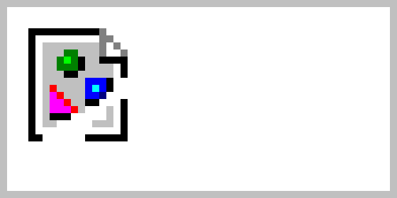

```
---
title: MDF showcase document
author: Jane Smith
date: 12 February 2020
---
```

# # Header 1

Lorem ipsum dolor sit amet, consectetur adipiscing elit.
Cras rutrum at turpis in commodo.
Proin nec risus ac urna semper ultrices id ut libero.
Quisque nec vulputate elit, id mollis nulla.
Donec eleifend blandit felis eu fermentum.
Duis faucibus eros non bibendum cursus.
Fusce ut gravida arcu, et vulputate erat.
Duis et porttitor sem.
Fusce pulvinar mattis enim nec luctus.
Donec quis fringilla justo.
 
## ## Header 2

Vestibulum tincidunt mi sed sem placerat, sodales faucibus lorem hendrerit.
Nunc et orci magna.
Donec molestie blandit egestas.
Integer volutpat nunc venenatis orci bibendum condimentum.
Nunc commodo tempus lorem sed sodales.
Phasellus id diam in tellus imperdiet interdum.
Class aptent taciti sociosqu ad litora torquent per conubia nostra, per inceptos himenaeos.

### ### Header 3

Praesent varius porta justo id placerat.
Duis vehicula, dolor nec venenatis interdum, erat felis condimentum nunc, a aliquam mi nunc sed metus.
Vestibulum eget neque ligula.
Duis eget urna ac eros cursus laoreet et ac justo.
Nulla varius maximus lectus.
Pellentesque aliquet lectus vel sem maximus placerat.
In quis tristique nulla, vel lobortis orci.
Morbi venenatis vehicula nulla a faucibus.
Morbi iaculis cursus justo a condimentum.

#### #### Header 4

Pellentesque nisl massa, maximus sed arcu vel, pharetra ultrices metus.
Sed faucibus vel neque et tempus.
In rhoncus vehicula lacinia.
Nunc scelerisque neque eget feugiat facilisis.

0123456789
% & # @ â é ň ç đ ß µ œ ø α β γ δ ε π σ ω Ω « » ¢ $ € £


---

`---` (three dashes) make a ruler, like above.

Force a line break␣␣  
by ending a line in two spaces.

Force a page break with `<div style="page-break-before: always;"></div>`:

<div style="page-break-before: always;"></div>


<style>
  table.syntax > tbody > tr:nth-child(odd) { background: none; }
  table.syntax > tbody > tr > td,th { padding: 10px 20px; }
  table.syntax td.center { text-align: center; }
  table.syntax table tr.header { background: none; } /* why is this necessary? */
</style>
<table class="syntax">
  <tr>
    <td class="center">**bold**</td>
    <td>`**bold**`</td>
  </tr>
  <tr>
    <td class="center">_italic_</td>
    <td>`_italic_`</td>
  </tr>
  <tr>
    <td class="center">~~strikethrough~~</td>
    <td>`~~strikethrough~~`</td>
  </tr>
  <tr>
    <td class="center">`verbatim`</td>
    <td>`` `verbatim` ``</td>
  </tr>
  <tr>
    <td class="center">^super^script</td>
    <td>`^super^script`</td>
  </tr>
  <tr>
    <td class="center">~sub~script</td>
    <td>`~sub~script`</td>
  </tr>
  <tr>
    <td class="center">literal \*</td>
    <td>`literal \*`</td>
  </tr>
  <tr>
    <td class="center">en-dash: --</td>
    <td>`en-dash: --`</td>
  </tr>
  <tr>
    <td class="center"><https://example.com/></td>
    <td>`<https://example.com/>`</td>
  </tr>
  <tr>
    <td class="center">[Named Link](https://example.com/)</td>
    <td>`[Named Link](https://example.com/)`</td>
  </tr>
  <tr>
    <td class="center">[Link to Header 1](#header-1) <br>(broken in wkhtmlpdf)</td>
    <td>`[Link to Header 1](#header-1)`</td>
  </tr>
  <tr>
    <td class="center">Footnote[^1]</td>
    <td>
<pre>Footnote[^1]
[^1] This is a footnote.</pre></td>
  </tr>
[^1]: This is a footnote.


<tr>
<td class="center"><span style="padding: 1px 2px; color: white; background-color: red;">custom HTML</span></td>
<td>
<pre>&lt;span style="padding: 1px 2px;
color: white; background-color: red;">
custom HTML&lt;/span></pre>
</td>
</tr>

<tr>
<td>

 - Make a list with a dash,
 * Or an asterisk.
   - Indenting nests.

</td>
<td>
<pre>- Make a list with a dash,
 * Or an asterisk.
   - Indenting nests.</pre>
</td>
</tr>


<tr>
<td>

 1. Ordered lists with any number.
 1. Really, any number.

</td>
<td>
<pre>1. Ordered lists with any number.
1. Really, any number.</pre>
</td>
</tr>

<tr>
<td>

> He said.
> 
> > She said.

</td>
<td>
<pre>> He said.
> 
> > She said.</pre>
</td>
</tr>

<tr>
<td>
```
def uwc(line):
	words = line.split()
	unique = set(words)
	return len(unique)
```
</td>
<td>
````
```
def uwc(line):
	words = line.split()
	unique = set(words)
	return len(unique)
```
````
</td>
</tr>

<tr>
<td>

{width=5cm}

</td>
<td>
```
{width=5cm}
```
</td>
</tr>

<tr>
<td>

  Right    Left       Center    Default
-------    ------   ---------   -------
12         12       12          12  
123        123      123         123  
1          1        1           1

</td>
<td>
```
  Right    Left       Center    Default
-------    ------   ---------   -------
12         12       12          12  
123        123      123         123  
1          1        1           1
```
</td>
</tr>

<tr>
<td>
 - [x] foo
 - [ ] bar
 - [ ] baz
</td>
<td>
```
 - [x] foo
 - [ ] bar
 - [ ] baz
```
</td>
</tr>
</table>

