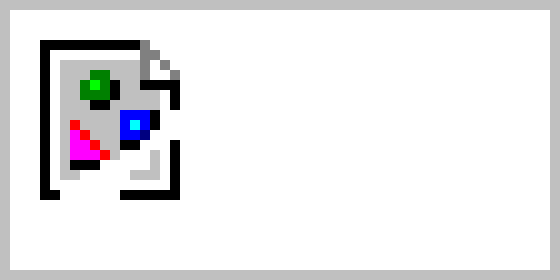

title:    MDF showcase document
subtitle: With a subtitle
date:     %a %d %B, %Y
author:   Jane Smith
          Joe Smith
style:    Sapphire TextSoftBlack


<!-- something about markdown -->


<!--
# Metadata tags

At the very top of the document, you can add metadata tags as `tag: value`.

 - The tags `title`, `date`, and `author` are special and will be presented in a header at the top of the first page.
 - Tags can continue over multiple lines, and are presented on separate lines.
 - The date tag can be an arbitrary string, but any [strftime](https://strftime.org/) tags are formatted for the date of compilation. Assuming the date is 28 June, 2022:
    - `1 Jan 2022` stays `1 Jan 2022`
    - `%a %d %B, %Y` becomes `Tue 28 June, 2022`
    - `%Y-%m-%d` becomes `2022-06-28`
 - An empty line denotes the end of the tags and the start of the document. This empty line is not optional.

Metadata tags for this document:
-->

```
title:    MDF showcase document
subtitle: With a subtitle
date:     %a %d %B, %Y
author:   Jane Smith
          Joe Smith
style:    Sapphire TextSoftBlack
```


# # Header 1

Lorem ipsum dolor sit amet, consectetur adipiscing elit.
Cras rutrum at turpis in commodo.
Proin nec risus ac urna semper ultrices id ut libero.
Quisque nec vulputate elit, id mollis nulla.
Donec eleifend blandit felis eu fermentum.
Duis faucibus eros non bibendum cursus.
Duis et porttitor sem.
 
## ## Header 2

Vestibulum tincidunt mi sed sem placerat, sodales faucibus lorem hendrerit.
Nunc et orci magna.
Donec molestie blandit egestas.
Integer volutpat nunc venenatis orci bibendum condimentum.
Nunc commodo tempus lorem sed sodales.

### ### Header 3

Praesent varius porta justo id placerat.
Duis vehicula, dolor nec venenatis interdum, erat felis condimentum nunc, a aliquam mi nunc sed metus.
Vestibulum eget neque ligula.
Duis eget urna ac eros cursus laoreet et ac justo.

#### #### Header 4

Pellentesque nisl massa, maximus sed arcu vel, pharetra ultrices metus.
Sed faucibus vel neque et tempus.
In rhoncus vehicula lacinia.
Nunc scelerisque neque eget feugiat facilisis.

0123456789
% & # @ â é ň ç đ ß µ œ ø α β γ δ ε π σ ω Ω « » ¢ $ € £


---

`---` (three dashes) make a ruler, like above.

Force a line break␣␣  
by ending a line in two spaces.

Force a page break with `<pagebreak />`
<pagebreak />


## Inline formatting

<style id="inline-fmt-table">
  style#inline-fmt-table + table tr:nth-child(odd) { background: none; }
  style#inline-fmt-table  + table td { padding: 10px 50px; }
  style#inline-fmt-table  + table th { padding: 10px 50px; }
</style>

Rendered                                   | Code
-------:                                   | ----
**bold**                                   | `**bold**`
_italic_                                   | `_italic_`
<s>strikethrough</s>                       | `<s>strikethrough</s>`
`verbatim`                                 | `` `verbatim` ``
<sup>super</sup>script                     | `<sup>super</sup>script`
<sub>sub</sub>script                       | `<sub>sub</sub>script`
literal \*                                 | `literal \*`
<https://example.com/>                     | `<https://example.com/>`
[Named Link](https://example.com/)         | `[Named Link](https://example.com/)`


<page-break />
## Block Formatting


### Unordered Lists

 - Make a list by starting each line with a dash and a space,
 * Or an asterisk,
 + Or a plus.
    - Indent at least three more spaces to make a sublist.
        - And again.

```
 - Make a list by starting each line with a dash and a space,
 * Or an asterisk,
 + Or a plus.
    - Indent at least three more spaces to make a sublist.
        - And again.
```


<pagebreak>

### Ordered Lists

 2. Ordered lists with starting number.
 2. Next items are automatic.

```
 2. Ordered lists with starting number.
 2. Next items are automatic.
```


### Checklists

 - [ ] This needs doing.
 - [x] This is done!
 - [ ] Yeah need to work on this...

```
 - [ ] This needs doing.
 - [x] This is done!
 - [ ] Yeah need to work on this...
```


### Quote Blocks

> He said.
> 
> > She said.

```
> He said.
> 
> > She said.
```


### Code Blocks

````
```
def uwc(line):
	words = line.split()
	unique = set(words)
	return len(unique)
```
````


<pagebreak>

### Images

{width=5cm}

```
{width=5cm}
```


### Tables

Right  |  Left  |  Center  |  Default
----:  |  :---  |  :----:  |  -------
12     |  12    |  12      |  12  
123    |  123   |  123     |  123  
1      |  1     |  1       |  1

```
Right  |  Left  |  Center  |  Default
----:  |  :---  |  :----:  |  -------
12     |  12    |  12      |  12  
123    |  123   |  123     |  123  
1      |  1     |  1       |  1
```
